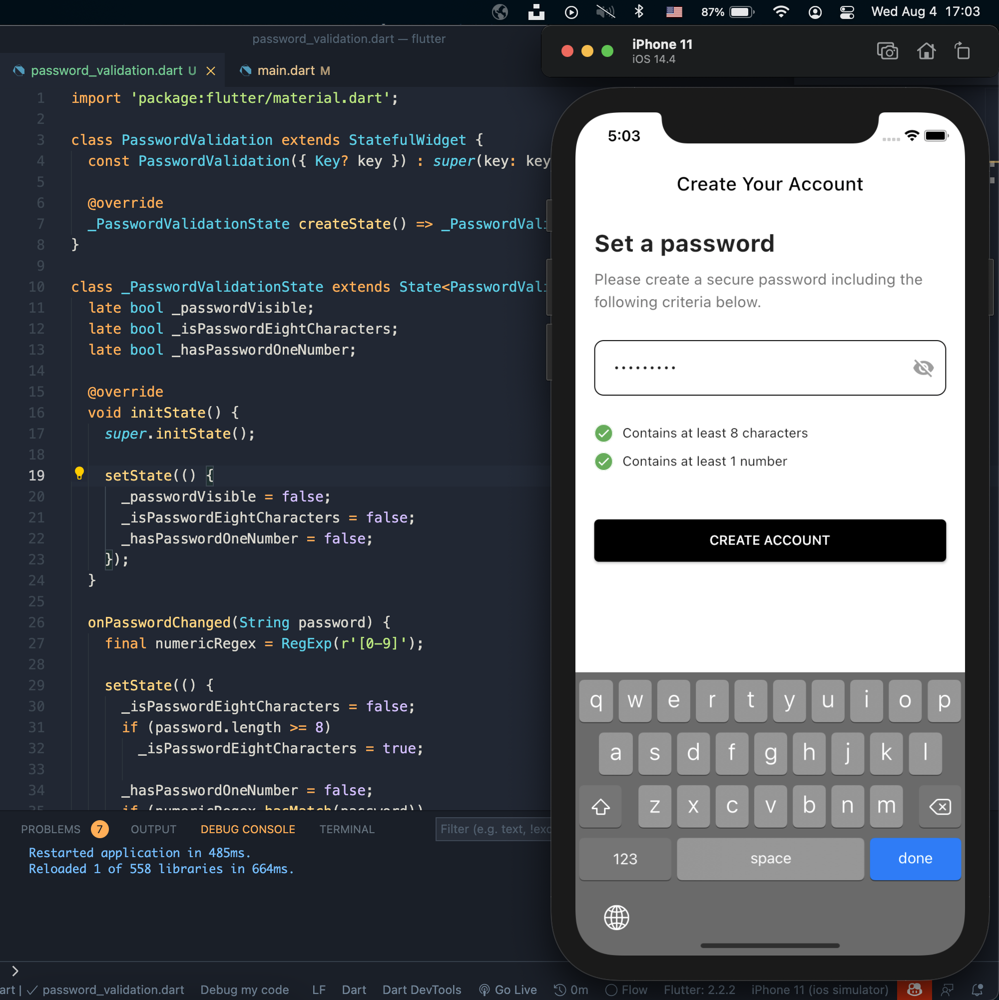

## Flutter Password Validation - Day 29

```dart
class Afgprogrammer extends Flutter100DaysOfCode {
  video() {
    return {
      "title": "Flutter Password Validation",
      "description": "Let's see how simple you can validate a password in Flutter.",
      "day": 29,
      "videoLink": "https://youtu.be/Uahlo90ER18"
    }
  }
}
```
### [Watch it on Youtube](https://youtu.be/Uahlo90ER18)

## Previous Designs
[Checkout my Youtube channel](https://youtube.com/afgprogrammer)


## Development Setup
Clone the repository and run the following commands:
```
flutter pub get
flutter run
```

## Screenshot



## Links

* [Website](https://afgprogrammer.com)
* [Youtube channel](https://youtube.com/afgprogrammer)
* [Twitter](https://twitter.com/afgprogrammer)
* [Instagram](https://instagram.com/afgprogrammer)
